# ProInter_Group_F
## Realització backend amb Django.
#### Inici 23/04/25

# BACKEND

### Instal·lació de l'entorn virtual:
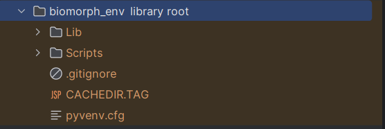

### Instal·lació de Django:
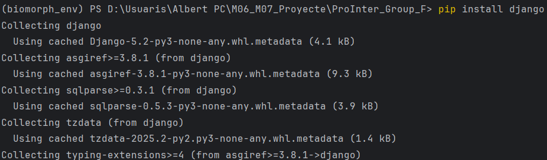

### Inici del projecte
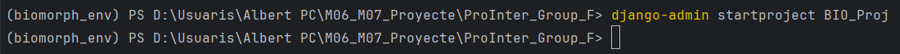

### Resultat:
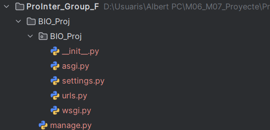

### Primera app - cart (carret de la compra)
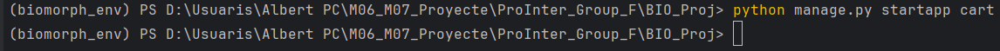

### App - productes
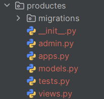

Afegim a l'apartat d'apps instal·lades i afegim productes.
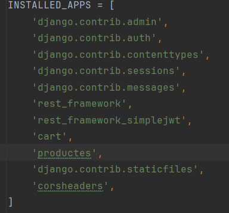

Anem a la carpeta models.py i escriuré els camps de la taula productes (en un principi es troba buit).

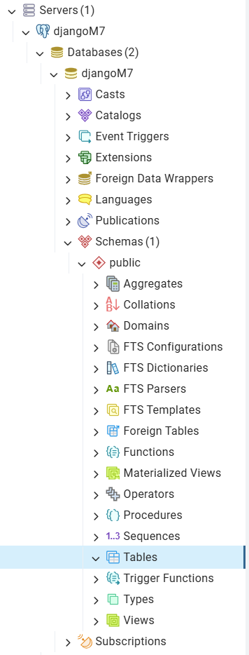

(De moment no hem fet cap make migrations de cap app)

### Productes -> models.py
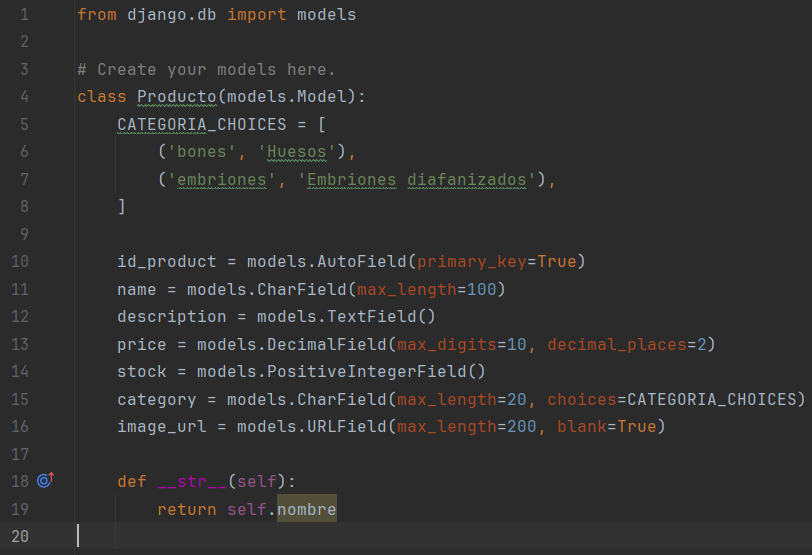

##### Faré les comandes:
· python manage.py makemigrations

· python manage.py migrate

### Resultat:
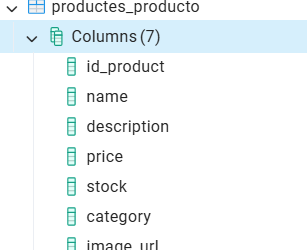

En un principi està tot buit, és per això que introduïré els camps necessaris.
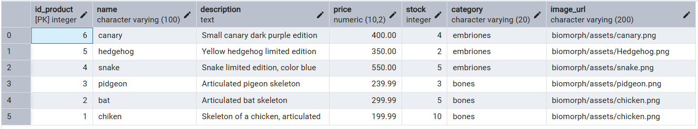

# FRONTEND
